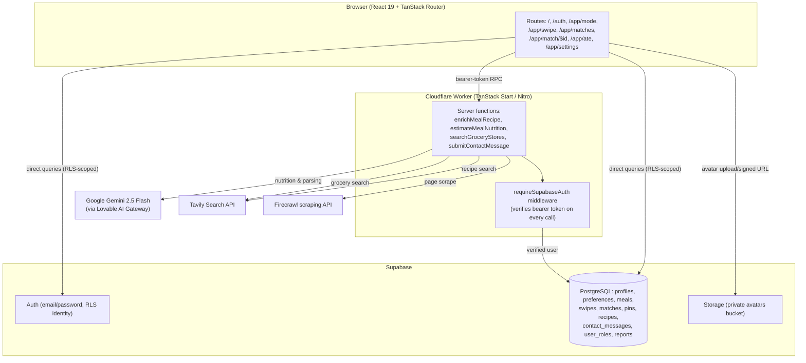

# Swipe & Bite

**Swipe right on your next meal.** A dating-app-style experience for deciding what to cook, personalized to your diet, your goals, and the time of day.

## Overview

Swipe & Bite turns "what should I eat" into a quick, visual swipe. A user signs up, sets their dietary restrictions, allergies, health conditions, and eating goal in Settings, and is dropped into a deck of meal cards filtered to those preferences.

The app detects the current time of day and defaults the deck to breakfast, lunch, or dinner (a manual toggle, plus a dessert option and a gluten-free filter, are available on the Match screen). Swiping — or tapping the on-screen buttons — right "matches" a meal and saves it; left discards it. A lightweight scoring pass reorders the deck based on the cuisines and tags the user has liked or disliked in past swipes, and a rewind button undoes the last swipe if it created a match by mistake.

Every match is saved and viewable later. Opening a match kicks off a real-recipe lookup: the server searches a curated list of recipe sites, scrapes the best match, and falls back to an AI parse of the page content, caching the result so the same recipe is only fetched once across all users. The match page shows the full recipe (ingredients, step-by-step instructions, prep/cook time, servings), a computed spice level and culinary skill level, an allergy check against the user's saved allergies, and a grocery-store lookup by zip code. Marking a meal "Ate it" logs it to the Eat Log, where the day's estimated calories, protein, carbs, and fat are totaled (estimated by AI when a meal doesn't already have cached nutrition data).

The app is built as a single "cook" experience — there is no restaurant-ordering or takeout mode in the interface; every match is meant to be cooked at home.

## Features

- **Swipe-based meal discovery** — drag a card left/right, or use the on-screen Nope / Rewind / Yum buttons
- **Rewind** — undo the last swipe, restoring the card to the deck and removing the swipe/match it created
- **Automatic meal timing** — deck defaults to breakfast, lunch, or dinner based on the current hour, with a manual breakfast/lunch/dinner/dessert toggle and a gluten-free quick filter
- **Lightweight personalization** — the deck is re-ranked using the cuisines and tags from the user's past right- and left-swipes
- **Dietary preferences & allergies** — dietary restrictions, allergens, health conditions (including a GLP-1 medication flag), and an eating goal, each with a free-text "other" option, editable any time in Settings
- **Meal matching** — a right swipe saves a match; matches persist until removed
- **Saved matches** — a grid of all matches, filterable by meal time, with per-item removal and a "clear all" action
- **Real recipe lookup** — recipe title, summary, ingredients, step-by-step instructions, prep/cook/total time, and servings, sourced from a curated list of recipe sites and cached per meal so it's only fetched once
- **Computed meal info** — spice level (Not spicy / Med / Very spicy), a culinary skill-level badge (Easy / Medium / Advanced), and an equipment list, all derived from the meal's tags, ingredients, and instructions
- **Allergy check** — flags whether a matched meal contains or avoids each of the user's saved allergens
- **Grocery store finder** — search for nearby grocery stores by zip code from the match page (see [Known Limitations](#known-limitations) — currently disabled behind a feature flag)
- **Eat Log** — mark a meal "eaten," see it grouped by day, and view a running total of calories, protein, carbs, and fat for today
- **AI-estimated nutrition** — when a meal has no cached nutrition data, an AI estimate is generated and cached back onto the meal for future users
- **Authentication** — email/password sign-up, sign-in, and password reset
- **Profile & settings** — display name, a short "food bio," and an avatar upload (validated by type and size, stored privately with signed URLs)
- **Accessibility** — a color-blind palette toggle and a reduce-motion toggle, both persisted to the user's profile
- **Contact form** — signed-in users can send a message, rate-limited server-side

## How It Works

1. A visitor signs up or signs in on `/auth` (email + password via Supabase Auth).
2. They land on the **Match** screen (`/app/mode`), which defaults to the current meal time and offers a "Cook Your Match" entry point.
3. On `/app/swipe`, they swipe (or tap) through a deck of up to 20 meals, filtered by meal time, gluten-free preference, and meals not already swiped.
4. A right swipe saves a match and shows a quick "It's a match!" overlay with a preview of the ingredients.
5. Matches collect on `/app/matches`, where the user can open one to see the full recipe on `/app/match/$id`.
6. Opening a match triggers real-recipe enrichment in the background (or serves the cached result if another user already unlocked that recipe).
7. Tapping "Ate it" logs the meal to `/app/ate`, where the day's nutrition totals are estimated and summed.
8. Diet, allergy, and accessibility preferences can be changed at any time from `/app/settings`.

## Eat Log

The Eat Log (`/app/ate`) is populated by tapping **Ate it** on a match's detail page, which inserts a row into the `pins` table for that user and meal.

- **What's tracked**: calories, protein, carbs, and fat per logged meal. If a meal's nutrition hasn't been estimated yet, the page calls the AI nutrition estimator on the fly and caches the result on the meal so it's instant next time.
- **Daily summary**: meals logged today are grouped and summed into a single "Today" card showing total calories, protein, carbs, and fat.
- **History**: all logged meals are listed (not just today's), most recent first, and can be removed individually.
- **Storage**: eat-log entries live in Supabase's `pins` table, scoped to the signed-in user via Row Level Security.

## Accessibility

- **Color-blind palette** — a toggle in Settings swaps the app's color tokens for a high-contrast blue palette (applied via a `.cb` class on the document root); the preference is stored on the user's profile and applied immediately.
- **Reduced motion** — a toggle in Settings collapses all CSS animation/transition durations to near-zero and disables Framer Motion's animations app-wide.
- **Accessible controls** — icon-only buttons (back, sign out, remove match, avatar upload, etc.) carry `aria-label`s, and swiping has a non-gesture fallback (Nope / Rewind / Yum buttons are regular focusable buttons).
- Pre-authentication, both toggles persist to `localStorage` so the preference survives a page reload before sign-in; after sign-in they sync to the `profiles` table.
- These are the accessibility features actually implemented — WCAG conformance has not been audited or verified.

## Tech Stack

| Category | Technology | Purpose |
|---|---|---|
| Frontend | React 19 | UI rendering |
| Framework | TanStack Start | Full-stack React framework (file-based routing + server functions), served by Nitro |
| Routing | TanStack Router | File-based client routing (`src/routes/`), code-generated route tree |
| Styling | Tailwind CSS 4 | Utility-first styling, custom theme tokens in `src/styles.css` |
| UI components | Radix UI primitives via shadcn/ui | Accessible building blocks (dialogs, switches, avatars, etc.) |
| Animation | Framer Motion | Swipe gestures, page/element transitions |
| Icons | lucide-react | Icon set used throughout the UI |
| Toasts | Sonner | In-app notifications |
| Validation | Zod | Server function input validation and route search-param parsing |
| Database & Auth | Supabase (PostgreSQL, Auth, Storage, Row Level Security) | User accounts, app data, avatar storage |
| AI | Google Gemini 2.5 Flash, via the Lovable AI Gateway | Nutrition estimation, recipe-page parsing |
| Recipe/grocery search | Tavily Search API | Finds candidate recipe pages and nearby grocery stores |
| Recipe scraping | Firecrawl | Structured extraction from recipe web pages |
| Deployment | Cloudflare Workers | Production hosting, via `@cloudflare/vite-plugin` and Wrangler |
| Runtime & bundler | Bun, Vite 7 | Package management, dev server, and production build |
| Language | TypeScript | End-to-end typing, including generated Supabase types |

`@tanstack/react-query` and `react-hook-form` are installed (pulled in by the TanStack Start toolchain and the shadcn/ui component set) but are not actively used for data fetching or form state in this app — pages call the Supabase client directly inside `useEffect`, and forms use plain controlled inputs.

## Architecture

The app is a single TanStack Start project: React pages and server functions live in the same codebase and are compiled into one Cloudflare Worker. Client code calls Supabase directly for reads/writes protected by Row Level Security; anything that needs a secret (an AI or search API key, or the Supabase service-role key) goes through a TanStack Start **server function**, which runs only on the server.



Notes on the diagram:

- Every server function is wrapped in a `requireSupabaseAuth` middleware that rejects requests without a valid Supabase bearer token, then exposes the authenticated user's id and an RLS-scoped Supabase client to the handler.
- `enrichMealRecipe` (recipe lookup) and `estimateMealNutrition` also use a Supabase **service-role** client to write shared, cross-user caches (`recipes.enrichment_status`, `meals.nutrition`) after re-checking that another request hasn't already populated them.
- The `client.server.ts` service-role client is never sent to the browser; it only exists inside server functions.

## Data Flow

1. **User interaction** — a swipe, a tap, a form submit — updates local React state.
2. **Direct Supabase calls** for anything covered by Row Level Security (swipes, matches, pins, preferences, profile updates) go straight from the browser to Supabase using the publishable (anon) key; RLS policies enforce that a user can only read/write their own rows.
3. **Server functions** handle anything that needs a private key or trusted server-side logic: recipe enrichment, nutrition estimation, grocery search, and contact-form submission. The browser calls these over an authenticated RPC; TanStack Start's client middleware attaches the user's current Supabase access token to every call automatically.
4. **External APIs** are only ever called from server functions, never from the browser: Tavily (recipe/grocery search), Firecrawl (page scraping), and Gemini via the Lovable AI Gateway (nutrition estimation and recipe-text parsing).
5. **Caching** — successful recipe enrichments and nutrition estimates are written back to the `recipes` and `meals` tables via the service-role client, so the same meal is only ever enriched or estimated once across all users.
6. **UI** re-renders from the updated local state (and, on the next full page load, from the freshly cached database rows).

## Database

The database is PostgreSQL, managed by Supabase, with Supabase Auth for identity and Row Level Security enforced on every application table.

| Table | Purpose |
|---|---|
| `profiles` | Display name, food bio, avatar path, accessibility toggles; one row per authenticated user (`id` = `auth.users.id`) |
| `preferences` | Dietary restrictions, allergies, health conditions, GLP-1 flag, eating goal per user |
| `meals` | The shared meal catalog (name, cuisine, ingredients, instructions, tags, meal-time slots, tools, cached nutrition) |
| `swipes` | Every left/right swipe a user has made, per meal and mode |
| `matches` | Meals a user has swiped right on; can be archived or deleted |
| `pins` | Eat Log entries — meals a user has marked as eaten |
| `recipes` | Cached, enriched recipe data (source URL, ingredients, steps, timings) — one row per meal, shared across all users |
| `contact_messages` | Messages submitted through the Contact form |
| `user_roles` | Role assignments (e.g. admin), stored separately from `profiles` to avoid privilege-escalation via a user-editable table |
| `reports` | Schema exists for flagging a meal, defined in the database but not currently exposed in the UI |

Key points verified in the migrations under `supabase/migrations/`:

- Every user-scoped table has RLS policies restricting `SELECT`/`INSERT`/`UPDATE`/`DELETE` to rows where `auth.uid()` matches the row's `user_id` (or `id` for `profiles`).
- `meals` is a public read-only catalog (`SELECT` allowed to any authenticated request where `is_alcohol = false`); writes are restricted to a `has_role(auth.uid(), 'admin')` check.
- Role membership lives in its own `user_roles` table with a `SECURITY DEFINER` `has_role()` function, rather than a role column on `profiles`, specifically to prevent a user from granting themselves admin via a normal profile update.
- The `avatars` Storage bucket is private; the app reads avatars through short-lived signed URLs rather than public URLs.

## Project Structure

```
swipe-and-bite-app/
├── src/
│   ├── routes/                  # File-based routes (one file per URL)
│   │   ├── index.tsx             # Landing page
│   │   ├── auth.tsx               # Sign in / sign up / forgot password
│   │   ├── reset-password.tsx     # Password reset
│   │   ├── contact.tsx            # Contact form
│   │   ├── legal.disclaimer.tsx   # Health/nutrition disclaimer
│   │   ├── app.tsx                # Authenticated app shell + bottom nav
│   │   ├── app.mode.tsx           # Meal-time picker / deck entry point
│   │   ├── app.swipe.tsx          # Swipe deck
│   │   ├── app.matches.tsx        # Saved matches grid
│   │   ├── app.match.$id.tsx      # Recipe detail + grocery finder
│   │   ├── app.ate.tsx            # Eat Log
│   │   └── app.settings.tsx       # Profile, accessibility, preferences
│   ├── components/
│   │   ├── ui/                    # shadcn/ui primitives (Radix-based)
│   │   ├── Logo.tsx
│   │   └── preferences-form.tsx   # Shared dietary/allergy/health option lists
│   ├── hooks/
│   │   └── use-auth.ts            # Supabase auth session hook
│   ├── lib/
│   │   ├── match.functions.ts     # Server fns: nutrition estimate, grocery search
│   │   ├── recipe.functions.ts    # Server fn: recipe enrichment pipeline
│   │   ├── contact.functions.ts   # Server fn: contact form submission
│   │   ├── meal-helpers.ts        # Spice/skill/equipment/allergy helpers
│   │   └── a11y.ts                # Color-blind / reduce-motion persistence
│   ├── integrations/supabase/     # Generated Supabase clients, auth middleware, DB types
│   ├── start.ts                   # TanStack Start server-function middleware registration
│   ├── router.tsx                 # Router + default error boundary
│   └── styles.css                 # Tailwind v4 theme tokens
├── supabase/
│   ├── config.toml
│   └── migrations/                 # SQL migrations (schema, RLS policies, storage buckets)
├── import-themealdb-to-supabase.mjs # One-off script to seed meals from TheMealDB
├── wrangler.jsonc                  # Cloudflare Worker config
├── vite.config.ts
├── package.json
└── README.md
```

## Prerequisites

- [Bun](https://bun.sh/) (the project ships a `bun.lock`/`bun.lockb` and all scripts are defined for `bun run`)
- A Supabase project (for the database, auth, and storage)
- Optional, for full functionality: API keys for Google Gemini access via the Lovable AI Gateway, Tavily, and Firecrawl (the app degrades gracefully without them — see [Environment Variables](#environment-variables))

No specific Bun or Node version is pinned in this repository (no `engines` field or `.tool-versions`), so use a current stable release of either.

## Installation

```bash
git clone https://github.com/katkay1997/swipe-and-bite-app.git
cd swipe-and-bite-app
bun install
```

Create a `.env` file in the project root (see [Environment Variables](#environment-variables) below for what each value is).

## Environment Variables

| Variable | Purpose | Required |
|---|---|---|
| `SUPABASE_URL` | Your Supabase project URL, used by server functions and the admin/service-role client | Yes |
| `VITE_SUPABASE_PUBLISHABLE_KEY` | Supabase anon/publishable key | Yes (the browser client currently ships with a hardcoded fallback in `src/integrations/supabase/client.ts`, but server functions require this to be set) |
| `SUPABASE_SERVICE_ROLE_KEY` | Supabase service-role key, used server-side only to write shared caches (recipe/nutrition data) — bypasses Row Level Security | Yes, for recipe caching and admin-style writes to succeed |
| `LOVABLE_API_KEY` | Key for the Lovable AI Gateway, used to call Google Gemini for nutrition estimation and recipe-text parsing | No — those features return a clear "not configured" error without it |
| `TAVILY_API_KEY` | Tavily Search API key, used for recipe-site search and the grocery-store finder | No — those features return a clear error without it |
| `FIRECRAWL_API_KEY` | Firecrawl API key, used to scrape and structurally extract recipe pages | No — recipe enrichment falls back to parsing the raw search snippet with AI if this is missing |

Never commit real values for any of these. `SUPABASE_SERVICE_ROLE_KEY` in particular bypasses Row Level Security and must be treated as a secret.

## Running Locally

```bash
bun run dev
```

The dev server runs on Vite's default port (`http://localhost:5173`).

## Available Scripts

| Command | Purpose |
|---|---|
| `bun run dev` | Start the Vite dev server |
| `bun run build` | Production build |
| `bun run build:dev` | Build in development mode (unminified, for debugging a production-shaped build) |
| `bun run preview` | Serve the production build locally |
| `bun run lint` | Run ESLint over the project |
| `bun run format` | Format the codebase with Prettier |

## Deployment

The project targets **Cloudflare Workers**, configured via `wrangler.jsonc`:

- `main` points at `@tanstack/react-start/server-entry`, the framework's generated server entry point.
- The Cloudflare build integration is provided by `@cloudflare/vite-plugin`, wired in automatically by `@lovable.dev/vite-tanstack-config` (see the comment at the top of `vite.config.ts` — plugins are pre-configured there and should not be added again manually).
- `compatibility_flags: ["nodejs_compat"]` enables the subset of Node APIs the server functions rely on.

Deploying requires the same environment variables listed above to be configured as Cloudflare Worker secrets (via `wrangler secret put` or the Cloudflare dashboard), since the build step alone does not embed server-only secrets into the Worker.

## Security

- **Authentication** is handled entirely by Supabase Auth (email/password); no custom session or password handling exists in this codebase.
- **Row Level Security** is enabled on every application table, scoping reads and writes to the authenticated user (`auth.uid()`), with `meals` as the one intentionally public, read-only table.
- **Role separation**: admin-style permissions live in a dedicated `user_roles` table checked via a `SECURITY DEFINER` function, not a self-editable column, to prevent privilege escalation.
- **Service-role key usage is server-only**: `src/integrations/supabase/client.server.ts` throws if the service-role key or URL is missing, and this client is never imported into browser-bundled code paths.
- **Server functions require a valid bearer token**: `requireSupabaseAuth` rejects any server function call without a valid Supabase-issued JWT before the handler runs.
- **Avatar storage is private**: the `avatars` bucket is not public; the app serves avatars through short-lived signed URLs, and uploads are validated by MIME type and size before being written.
- **Contact form abuse controls**: the submitted email must match the authenticated user's email, and submissions are rate-limited to 5 per hour per user, both enforced server-side.

These are the security-relevant practices actually present in the code; no independent security audit has been performed.

## Error Handling

- **AI failures** (nutrition estimation, recipe parsing): rate limiting (HTTP 429) and exhausted credits (HTTP 402) from the Lovable AI Gateway are caught and surfaced as specific, user-facing error strings rather than generic failures.
- **Recipe enrichment failures**: each stage (no search candidates, scrape failure, no valid extraction) is caught individually, recorded on the `recipes` row as a `failed` status with a reason, and the UI shows a "Recipe details coming soon" fallback instead of an infinite loading state.
- **Grocery/recipe search failures**: a non-OK response from Tavily is caught and returned as a typed error rather than thrown, and the UI shows "No grocery stores found" or a toast error.
- **Authentication failures**: sign-in errors are normalized ("Invalid credentials") for common cases and otherwise shown via a toast with the underlying message.
- **Loading and empty states**: every data-driven route (swipe deck, matches, eat log) has an explicit loading state and a distinct empty state (e.g. "You've seen them all!", "Nothing eaten yet").
- **Database errors** on inserts/deletes are logged to the console and surfaced to the user via a toast rather than failing silently.
- A top-level TanStack Router error boundary (`src/router.tsx`) catches unhandled route errors, shows a generic "Something went wrong" screen, and exposes the raw error message only in development builds.

## Known Limitations

- **Grocery store search is currently disabled**: `searchGroceryStores` in `src/lib/match.functions.ts` has a hardcoded kill switch (`GROCERY_SEARCH_ENABLED = false`) and always returns "Grocery search temporarily disabled," regardless of whether a Tavily key is configured.
- **No takeout/restaurant-ordering mode**: the swipe route only accepts `mode: "cook"`; there is no in-app path to order a matched meal from a restaurant.
- **Nutrition and recipe data are AI-derived or scraped**, not verified against a nutrition database — figures are estimates and may not match the actual prepared meal (see the in-app health disclaimer at `/legal/disclaimer`).
- **Recipe enrichment depends on external services** (Tavily, Firecrawl, and the Lovable AI Gateway) and a fixed allowlist of recipe domains; a meal with no matching page on those domains will show "Recipe details coming soon."
- **Recipe/nutrition caches are shared globally** (keyed by meal, not by user), so the first user to open a given meal determines the cached recipe and nutrition estimate for everyone after them.
- **No automated test suite** exists in this repository.

## Future Improvements

Based on scaffolding and planning notes already present in the repository, but not active in the app today:

- **Rewards / badge system** — `src/routes/app.rewards.tsx` implements a full cooking-milestone and explorer-badge UI against a `profiles.badges` column and an `ate` table, but the route isn't linked from the bottom navigation and the file's own header comment marks it as not yet activated.
- **Re-enabling grocery search** — flipping the `GROCERY_SEARCH_ENABLED` flag back on once the feature is ready to ship again.
- **Welcome email on sign-up** — noted in `.lovable/plan.md` as a planned enhancement to the sign-up flow; no email-sending code exists yet.
- **Meal reporting** — a `reports` table with a `report_kind` enum already exists in the schema, but no UI currently writes to it.

## Technical Highlights

- Full-stack TypeScript across the browser, server functions, and generated database types.
- A single-deploy architecture (TanStack Start + Cloudflare Workers) where UI routes and server-only logic share one codebase and one build.
- Row Level Security as the primary authorization boundary, with a separate role table and `SECURITY DEFINER` function to keep privilege checks out of user-editable data.
- A multi-stage, cached content-enrichment pipeline (search → scrape → structured extract → AI fallback → cache) that amortizes external API cost across all users of the app.
- Client-side personalization (swipe-history-based re-ranking) implemented without a dedicated recommendation service.
- Runtime accessibility theming (color-blind palette, reduced motion) driven by a single CSS class toggle plus a persisted user preference.

## License

No license file is present in this repository. All rights are reserved by the author unless a license is added.

## Author

**Katera M.** ([@katkay1997](https://github.com/katkay1997))
